# 🏗️ DevHub - Architettura del Progetto

## Indice

1. [📖 Cos'è DevHub](#-cosè-devhub)
2. [🌐 Filosofia Serverless](#-filosofia-serverless)
3. [💾 Flusso Dati](#-flusso-dati)
4. [📁 Struttura Cartelle](#-struttura-cartelle)
5. [🎯 Decisioni Chiave di Design](#-decisioni-chiave-di-design)
6. [🔧 Stack Tecnologico](#-stack-tecnologico)
7. [🚀 Come Funziona DevHub](#-come-funziona-devhub)

---

## 📖 Cos'è DevHub

**DevHub** è una piattaforma di apprendimento interattiva per sviluppatori che offre esercizi pratici su SQL, con un'interfaccia moderna e un ambiente di esecuzione completamente client-side.

L'app è composta da tre aree principali:

- **SQL Gym**: Palestra di esercizi SQL con difficoltà graduale, correzione automatica e AI Coach
- **DataLab**: Sandbox per caricare CSV e interrogarli con SQL
- **Schema Viewer**: Visualizzazione interattiva del database e diagrammi ER

---

## 🌐 Filosofia Serverless

### Perché Non C'è Backend?

DevHub adotta un'architettura **100% serverless** e client-side per diversi motivi strategici:

#### 1. **Semplicità di Deployment**

- Non richiede server, database o infrastruttura backend
- Deploy istantaneo su hosting statici (Vercel, Netlify, GitHub Pages)
- Nessun costo di infrastruttura
- Zero configurazione server-side

#### 2. **Sicurezza e Privacy**

- Tutti i dati sono generati e rimangono nel browser dell'utente
- Nessun dato personale viene inviato a server esterni
- Non serve autenticazione o gestione utenti
- Protezione totale dei dati sensibili

#### 3. **Performance**

- Esecuzione istantanea delle query SQL (nessuna latenza di rete)
- Nessun round-trip client-server
- Esperienza utente fluida e reattiva

#### 4. **Scalabilità Infinita**

- Il carico è distribuito sui browser degli utenti
- Non ci sono limiti di concurrent users
- Nessun bottleneck server-side

### Come AlaSQL Sostituisce il Server

**[AlaSQL](https://github.com/AlaSQL/alasql)** è un database SQL in JavaScript che gira completamente nel browser. Ecco come sostituisce un backend tradizionale:

| Funzionalità Backend | Soluzione AlaSQL |
|---------------------|------------------|
| Database Server (PostgreSQL, MySQL) | AlaSQL in-memory database nel browser |
| Query Execution Engine | Motore SQL di AlaSQL (supporta SELECT, JOIN, GROUP BY, etc.) |
| Data Persistence | Dati volatili ricreati ad ogni sessione |
| API REST | Funzioni JavaScript dirette (`runQuery`, `initDatabase`) |
| Connection Pool | Chiamate sincrone/asincrone in-memory |

**Vantaggi di AlaSQL:**

- Sintassi SQL standard (ANSI SQL-92)
- Supporto JOIN, aggregazioni, subquery
- Import/Export CSV, JSON
- Performance eccellenti per dataset fino a ~100k righe
- Zero configurazione

**Limitazioni:**

- Non supporta transazioni ACID persistenti
- Limitato dalla memoria del browser
- Non adatto per applicazioni multi-utente con dati condivisi

---

## 💾 Flusso Dati

### Come Vengono Generati i Dati


### Generazione Dati Mock

Il file [`services/sqlService.ts`](file:///Users/simonevitale/Desktop/APPS/devhub/services/sqlService.ts) contiene la logica di generazione dati:

```typescript
export const initDatabase = (difficulty: Difficulty) => {
  // 1. DROP tabelle esistenti (cleanup)
  alasql('DROP TABLE IF EXISTS recensioni');
  // ...altre tabelle

  // 2. CREATE tabelle con schema definito
  alasql('CREATE TABLE utenti (id INT, nome VARCHAR, email VARCHAR, paese VARCHAR, premium BOOLEAN)');
  // ...altre tabelle

  // 3. INSERT dati fissi + dati randomici
  const fixedUsers = [
    { id: 101, nome: 'Mario Rossi', email: 'mario.rossi@example.com', ... },
    // ...altri utenti fissi
  ];
  alasql('INSERT INTO utenti SELECT * FROM ?', [fixedUsers]);

  // 4. Generazione dati random per varietà
  const users = [];
  for (let i = 1; i <= 35; i++) {
    users.push({
      id: i, 
      nome: getRandom(firstNames), 
      email: 'user' + i + '@mail.com', 
      // ...
    });
  }
  alasql('INSERT INTO utenti SELECT * FROM ?', [users]);
}
```

### Perché i Dati Sono Volatili (Design Intenzionale)

I dati vengono **persi al refresh** del browser. Questa è una **scelta di design**, non un bug:

#### ✅ Vantaggi della Volatilità

1. **Approccio Educativo**
   - Gli utenti si concentrano sull'apprendimento, non sulla gestione dati
   - Ogni sessione è "pulita" e prevedibile
   - Nessun rischio di corruzione dati

2. **Riproducibilità**
   - Dataset consistente per ogni esercizio
   - Facilita il debugging e la validazione
   - Risultati attesi sempre uguali

3. **Performance**
   - Nessun overhead di persistenza (localStorage, IndexedDB)
   - Avvio app istantaneo
   - Nessuna sincronizzazione necessaria

4. **Privacy**
   - Nessun dato rimane sul dispositivo
   - Ideale per contesti condivisi (laboratori, biblioteche)

#### 🔄 Ciclo di Vita dei Dati

```text
Page Load → initDatabase() → Dati in RAM → Query eseguite → Page Refresh → DATI PERSI → Ricomincia
```

#### 💡 Quando Serve Persistenza?

Per il **DataLab** (sandbox CSV), i dati caricati dall'utente rimangono in memoria **solo per la sessione corrente**:

```typescript
// DataLab.tsx - CSV upload
const handleCsvUpload = (parsedData: CsvData) => {
  alasql(`DROP TABLE IF EXISTS ${parsedData.tableName}`);
  alasql(`CREATE TABLE ${parsedData.tableName}`);
  alasql(`INSERT INTO ${parsedData.tableName} SELECT * FROM ?`, [rows]);
  // Dati disponibili fino al refresh
}
```

---

## 📁 Struttura Cartelle

### Overview

```text
devhub/
├── components/          # Componenti React UI
├── services/            # Logica di business e dati
├── utils/               # Funzioni helper riutilizzabili
├── App.tsx              # Root component (routing)
├── index.tsx            # Entry point React
├── index.html           # HTML template
├── types.ts             # TypeScript type definitions
├── constants.ts         # Esercizi SQL (generati)
├── vite.config.ts       # Build configuration
└── tsconfig.json        # TypeScript configuration
```

### 📦 `services/` - Logica di Business

Contiene la logica core dell'applicazione:

| File | Responsabilità | Funzioni Principali |
|------|----------------|---------------------|
| **`sqlService.ts`** | Gestione database AlaSQL | `initDatabase()`, `runQuery()`, `getTablePreview()` |
| **`exerciseGenerator.ts`** | Generazione esercizi SQL | `generateExercises()`, topics, difficulties |
| **`mockAiService.ts`** | AI Coach (feedback agli utenti) | `analyzeQuery()`, `getHintForExercise()` |

**Esempio:** `sqlService.ts`

```typescript
// Eseguire query SQL
export const runQuery = (sql: string): QueryResult => {
  try {
    const result = alasql(sql);
    return { success: true, data: result, message: 'Query eseguita.' };
  } catch (e: any) {
    return { success: false, error: e.message, message: 'Errore' };
  }
};
```

### 🧩 `components/` - Componenti React

Componenti UI riutilizzabili e pagine:

| Componente | Descrizione |
|-----------|-------------|
| **`SqlGym.tsx`** | Pagina principale palestra SQL |
| **`DataLab.tsx`** | Sandbox CSV + SQL executor |
| **`Home.tsx`** | Homepage con card navigazione |
| **`SchemaViewer.tsx`** | Vista tabelle DB |
| **`SchemaERDiagram.tsx`** | Diagramma ER con Mermaid |
| **`ResultsTable.tsx`** | Tabella risultati query |
| **`ResultDiff.tsx`** | Confronto risultati attesi vs effettivi |
| **`CodeEditor.tsx`** | Editor SQL con syntax highlighting |
| **`ErrorBoundary.tsx`** | Gestione errori React |

**Pattern di Design:**

- Ogni componente gestisce il proprio stato locale (useState)
- Props drilling minimizzato
- Componenti piccoli e focalizzati (Single Responsibility)

### 🛠️ `utils/` - Helper Functions

Funzioni pure riutilizzabili:

| File | Funzionalità |
|------|-------------|
| **`sqlHelpers.ts`** | Validazione query, confronto risultati, utility SQL |
| **`csvParser.ts`** | Parsing CSV con PapaParse, inferenza tipi |
| **`statsHelpers.ts`** | Calcolo statistiche esercizi, progress tracking |

**Esempio:** `sqlHelpers.ts`

```typescript
// Confronta due array di risultati SQL ignorando l'ordine
export const compareResults = (userResult: any[], expectedResult: any[]): boolean => {
  if (userResult.length !== expectedResult.length) return false;
  const sortedUser = JSON.stringify(sortRows(userResult));
  const sortedExpected = JSON.stringify(sortRows(expectedResult));
  return sortedUser === sortedExpected;
};
```

---

## 🎯 Decisioni Chiave di Design

### Perché TypeScript?

TypeScript è **fondamentale** per un progetto di questa complessità:

#### 1. **Type Safety nella Generazione Esercizi**

Con oltre **600 esercizi SQL** generati dinamicamente, TypeScript previene errori:

```typescript
// types.ts
export interface Exercise {
  id: string;
  topicId: TopicId;
  difficulty: Difficulty;
  title: string;
  description: string;
  initialQuery: string;
  solutionQuery: string;
  hints: string[];
  explanation: string;
}

// Autocomplete e validazione automatica
const exercise: Exercise = {
  id: 'basics-easy-1',
  topicId: TopicId.Basics, // Enum validato
  difficulty: Difficulty.Easy, // Enum validato
  // ...TypeScript controlla che tutti i campi siano presenti
};
```

#### 2. **Intellisense e Developer Experience**

```typescript
// Autocomplete su risultati AlaSQL
const result: QueryResult = runQuery('SELECT * FROM utenti');
if (result.success) {
  result.data?.forEach(row => {
    // TypeScript sa che 'row' è un oggetto
  });
}
```

#### 3. **Refactoring Sicuro**

Quando renomiamo un tipo o un'interfaccia, TypeScript identifica **tutti** i punti da aggiornare.

#### 4. **Documentazione Vivente**

```typescript
export interface ValidationResult {
  isCorrect: boolean;
  userRowCount: number;
  expectedRowCount: number;
  message: string;
  warningLevel?: 'none' | 'yellow'; // Self-documenting
}
```

### Perché CSS Modules + Tailwind?

DevHub usa un **approccio ibrido**:

#### Tailwind CSS (Utility-First)

**Vantaggi:**

- Sviluppo rapido (no contesto switching tra HTML e CSS)
- Design system consistente (spacing, colors)
- Purge automatico (bundle size ridotto)
- Responsive design semplificato

**Esempio:**

```tsx
<button className="px-4 py-2 bg-blue-600 hover:bg-blue-500 text-white rounded-lg transition-all">
  Esegui Query
</button>
```

#### Perché Solo Tailwind (No CSS Modules al momento)

Il progetto usa **Tailwind puro** per semplicità:

1. **Inline styles** = component-scoped di default
2. **Design system unificato** (vedi [DESIGN_SYSTEM.md](file:///Users/simonevitale/Desktop/APPS/devhub/DESIGN_SYSTEM.md))
3. **JIT compiler** = performance ottimali
4. **Purge** = solo le classi usate finiscono in produzione

**Configurazione Tailwind:**

```html
<!-- index.html -->
<script src="https://cdn.tailwindcss.com"></script>
<script>
  tailwind.config = {
    darkMode: 'class',
    theme: {
      extend: {
        fontFamily: {
          sans: ['Inter', 'sans-serif'],
          mono: ['JetBrains Mono', 'monospace']
        },
        colors: {
          dark: {
            bg: '#0f172a',
            surface: '#1e293b'
          }
        }
      }
    }
  }
</script>
```

---

## 🔧 Stack Tecnologico

### Frontend Framework

- **React 19.2** - UI library
  - Hooks per state management
  - Strict Mode per debugging
  - Error Boundaries per resilienza

### Build Tool

- **Vite 6.2** - Build tool next-gen
  - Hot Module Replacement (HMR) istantaneo
  - ESBuild per transpilazione veloce
  - Bundle optimizations automatiche

**Perché Vite?**

- Startup 10-100x più veloce di Webpack/CRA
- HMR senza refresh completo
- Ottimizzazioni production automatiche

### Database

- **AlaSQL 4.9** - SQL database in JavaScript
  - SQL-92 compliant
  - Supporto JOIN, subquery, window functions
  - Import/Export CSV

### UI Libraries

- **Tailwind CSS** - Utility-first CSS framework
- **lucide-react** - Icon library moderna e leggera
- **Recharts 3.5** - Grafici per visualizzazioni dati
- **PapaParse 5.5** - Parser CSV robusto
- **sql-formatter 15.6** - Formattazione SQL

### TypeScript

- **TypeScript 5.8** - Type safety
  - Strict mode abilitato
  - Path aliases (`@/*`)
  - JSX support

---

## 🚀 Come Funziona DevHub

### Flow Completo di un Esercizio SQL

```mermaid
sequenceDiagram
    participant User
    participant SqlGym
    participant sqlService
    participant AlaSQL
    participant mockAiService

    User->>SqlGym: Apre app
    SqlGym->>sqlService: initDatabase('Easy')
    sqlService->>AlaSQL: CREATE TABLE utenti...
    sqlService->>AlaSQL: INSERT INTO utenti...
    AlaSQL-->>SqlGym: DB pronto

    SqlGym->>User: Mostra esercizio 1
    User->>SqlGym: Scrive query SQL
    User->>SqlGym: Click "Esegui"
    
    SqlGym->>sqlService: runQuery(userSql)
    sqlService->>AlaSQL: Esegue query
    AlaSQL-->>sqlService: Risultati
    sqlService-->>SqlGym: QueryResult { success, data }

    SqlGym->>SqlGym: checkResult(userResult, expectedResult)
    
    alt Risultato corretto
        SqlGym->>User: ✅ "Risultato perfetto!"
    else Risultato errato
        SqlGym->>User: ❌ "Il risultato non coincide"
        SqlGym->>User: Mostra Diff (ResultDiff.tsx)
    end

    User->>SqlGym: Click "Mostra Soluzione"
    SqlGym->>mockAiService: getHintForExercise(exerciseId)
    mockAiService-->>SqlGym: Soluzione + spiegazione
    SqlGym->>User: Mostra soluzione
```



### Inizializzazione Database

Quando l'utente apre SQL Gym:

```typescript
// SqlGym.tsx
useEffect(() => {
  initDatabase(difficulty); // Crea DB in memoria
  const exs = generateExercises(topic, difficulty); // Carica esercizi
  setExercises(exs);
}, [topic, difficulty]);
```

### Esecuzione Query

```typescript
// User scrive: SELECT * FROM utenti WHERE premium = true

const handleExecute = () => {
  const result = runQuery(userInput);
  
  if (!result.success) {
    setError(result.error); // Mostra errore SQL
    return;
  }

  setUserResult(result.data);
  
  // Confronta con soluzione attesa
  const validation = checkResult(result.data, expectedData);
  setIsCorrect(validation.isCorrect);
};
```

### Confronto Risultati

```typescript
// sqlHelpers.ts
export const checkResult = (userResult: any[], expectedResult: any[]): ValidationResult => {
  // 1. Controlla numero di righe
  if (userResult.length !== expectedResult.length) {
    return {
      isCorrect: false,
      message: `Hai ${userResult.length} righe, ne servono ${expectedResult.length}`
    };
  }

  // 2. Confronta contenuto (ignora ordine)
  const sortedUser = sortRows(userResult);
  const sortedExpected = sortRows(expectedResult);
  
  if (JSON.stringify(sortedUser) !== JSON.stringify(sortedExpected)) {
    return { isCorrect: false, message: 'Il contenuto non coincide' };
  }

  return { isCorrect: true, message: 'Perfetto!' };
};
```

### DataLab CSV Upload

```typescript
// DataLab.tsx
const handleCsvUpload = async (file: File) => {
  const parsed = await parseCsv(file); // PapaParse
  
  // Crea tabella temporanea
  alasql(`DROP TABLE IF EXISTS my_data`);
  alasql(`CREATE TABLE my_data`);
  alasql(`INSERT INTO my_data SELECT * FROM ?`, [parsed.rows]);
  
  setUploadedData(parsed);
  // User può ora interrogare 'my_data'
};
```

---

## 📊 Performance Considerations

### Ottimizzazioni Chiave

1. **Lazy Loading Esercizi**
   - Gli esercizi vengono generati solo quando necessari
   - Filtrati per topic e difficulty

2. **Memoization**

   ```typescript
   const filteredExercises = useMemo(() => 
     exercises.filter(e => e.difficulty === difficulty),
     [exercises, difficulty]
   );
   ```

3. **Virtual Scrolling** (Future Enhancement)
   - Per liste lunghe (600+ esercizi)

### Limitations

- **Max dataset size:** ~50k righe (limite browser memory)
- **Complex joins:** Performance degrada con >5 tabelle joined
- **CSV files:** Consigliato max 10MB

---

## 🔐 Sicurezza

### Threat Model

Essendo un'app client-side educativa:

✅ **Non a rischio:**

- SQL Injection (AlaSQL isolato, no backend)
- XSS (React escape automatico)
- CSRF (no server-side state)

⚠️ **Considerazioni:**

- User può modificare il client code (accettabile per scopi educativi)
- Nessuna validazione server-side (non serve)

---

## 🎓 Best Practices Seguite

### Architetturali

- ✅ Separation of Concerns (services/components/utils)
- ✅ Single Responsibility Principle
- ✅ DRY (Don't Repeat Yourself)
- ✅ Type Safety (TypeScript strict mode)

### Code Quality

- ✅ Consistent naming conventions
- ✅ Error boundaries per resilienza
- ✅ Immutable state updates
- ✅ Pure functions in utils/

### UX

- ✅ Instant feedback (no loading spinners)
- ✅ Clear error messages
- ✅ Progressive disclosure (hints → solution)
- ✅ Responsive design

---

## 🚧 Possibili Evoluzioni Future

### Persistenza Opzionale

```typescript
// Salvare progress in localStorage
const saveProgress = () => {
  localStorage.setItem('devhub_progress', JSON.stringify({
    completedExercises: [...],
    stats: {...}
  }));
};
```

### Multi-Language Support

- Python Gym (Pyodide per Python in browser)
- Angular/React Gym

### Collaborative Mode

- WebRTC per session sharing
- Real-time code collaboration

---

## 📚 Risorse Utili

- [AlaSQL Documentation](https://github.com/AlaSQL/alasql/wiki)
- [DB_SCHEMA.md](file:///Users/simonevitale/Desktop/APPS/devhub/DB_SCHEMA.md) - Schema database dettagliato
- [DESIGN_SYSTEM.md](file:///Users/simonevitale/Desktop/APPS/devhub/DESIGN_SYSTEM.md) - Design Bible

---

**Creato con ❤️ per sviluppatori che amano imparare facendo.**
