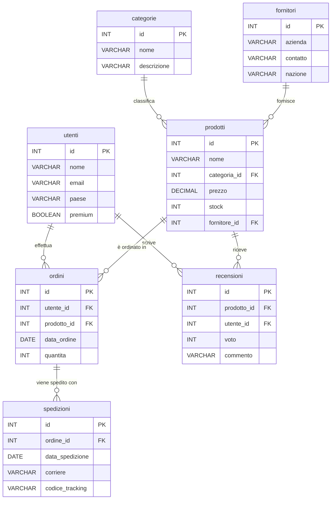

# DB_SCHEMA - DevHub SQL Database Documentation

Questo documento descrive lo schema completo del database utilizzato nell'applicazione DevHub per gli esercizi SQL.

## Panoramica

Il database simula un sistema di e-commerce con gestione di utenti, prodotti, ordini, spedizioni e recensioni. Include anche la gestione di categorie e fornitori.

---

## Elenco Tabelle

1. **utenti** - Informazioni sugli utenti registrati
2. **categorie** - Categorie di prodotti
3. **prodotti** - Catalogo prodotti
4. **ordini** - Ordini effettuati dagli utenti
5. **spedizioni** - Informazioni sulle spedizioni degli ordini
6. **fornitori** - Fornitori dei prodotti
7. **recensioni** - Recensioni dei prodotti da parte degli utenti

---

## Dettaglio Tabelle

### 1. utenti

Contiene le informazioni degli utenti registrati sulla piattaforma.

| Colonna | Tipo | Descrizione |
|---------|------|-------------|
| `id` | INT | Identificatore univoco dell'utente (chiave primaria) |
| `nome` | VARCHAR | Nome completo dell'utente |
| `email` | VARCHAR | Indirizzo email dell'utente |
| `paese` | VARCHAR | Paese di provenienza (es. Italia, Francia, USA) |
| `premium` | BOOLEAN | Indica se l'utente ha un account premium |

**Dati Esempio:**

- 4 utenti hardcoded (ID 101-104): Mario Rossi, Luigi Verdi, John Doe, Sophie Martin
- 35 utenti generati randomicamente (ID 1-35)
- Paesi disponibili: Italia, Francia, Germania, Spagna, USA, Regno Unito, Olanda

---

### 2. categorie

Classificazione dei prodotti in categorie.

| Colonna | Tipo | Descrizione |
|---------|------|-------------|
| `id` | INT | Identificatore univoco della categoria (chiave primaria) |
| `nome` | VARCHAR | Nome della categoria |
| `descrizione` | VARCHAR | Breve descrizione della categoria |

**Categorie Disponibili:**

1. Elettronica (Gadget)
2. Abbigliamento (Moda)
3. Casa (Arredo)

---

### 3. prodotti

Catalogo di tutti i prodotti disponibili.

| Colonna | Tipo | Descrizione |
|---------|------|-------------|
| `id` | INT | Identificatore univoco del prodotto (chiave primaria) |
| `nome` | VARCHAR | Nome del prodotto |
| `categoria_id` | INT | Riferimento alla categoria (chiave esterna → categorie.id) |
| `prezzo` | DECIMAL | Prezzo unitario del prodotto |
| `stock` | INT | Quantità disponibile in magazzino |
| `fornitore_id` | INT | Riferimento al fornitore (chiave esterna → fornitori.id) |

**Dati Esempio:**

- 5 prodotti hardcoded (ID 101-105): Laptop Pro, Smartphone X, Monitor 4K, T-Shirt Basic, Divano Moderno
- 40 prodotti generati randomicamente (ID 1-40)
- Prezzi variabili da €10 a €500
- Stock da 0 a 100 unità

---

### 4. ordini

Registra gli ordini effettuati dagli utenti.

| Colonna | Tipo | Descrizione |
|---------|------|-------------|
| `id` | INT | Identificatore univoco dell'ordine (chiave primaria) |
| `utente_id` | INT | Riferimento all'utente che ha effettuato l'ordine (chiave esterna → utenti.id) |
| `prodotto_id` | INT | Riferimento al prodotto ordinato (chiave esterna → prodotti.id) |
| `data_ordine` | DATE | Data in cui è stato effettuato l'ordine (formato YYYY-MM-DD) |
| `quantita` | INT | Quantità di prodotto ordinata |

**Dati Esempio:**

- 4 ordini hardcoded (ID 1001-1004) con date specifiche (Capodanno, Estate, Natale)
- 60 ordini generati randomicamente (ID 1-60)
- Date nell'anno 2023
- Quantità da 1 a 10 unità

---

### 5. spedizioni

Informazioni sulle spedizioni degli ordini.

| Colonna | Tipo | Descrizione |
|---------|------|-------------|
| `id` | INT | Identificatore univoco della spedizione (chiave primaria) |
| `ordine_id` | INT | Riferimento all'ordine spedito (chiave esterna → ordini.id) |
| `data_spedizione` | DATE | Data in cui è stata effettuata la spedizione (formato YYYY-MM-DD) |
| `corriere` | VARCHAR | Nome del corriere (DHL, UPS, FedEx, GLS) |
| `codice_tracking` | VARCHAR | Codice di tracciamento della spedizione |

**Dati Esempio:**

- 40 spedizioni generate randomicamente
- Corrieri disponibili: DHL, UPS, FedEx, GLS
- Codici tracking formato: TRK + numero casuale (es. TRK12345)

---

### 6. fornitori

Fornitori che riforniscono i prodotti.

| Colonna | Tipo | Descrizione |
|---------|------|-------------|
| `id` | INT | Identificatore univoco del fornitore (chiave primaria) |
| `azienda` | VARCHAR | Nome dell'azienda fornitrice |
| `contatto` | VARCHAR | Nome del contatto presso il fornitore |
| `nazione` | VARCHAR | Nazione in cui è basato il fornitore |

**Dati Esempio:**

- 3 fornitori hardcoded (ID 101-103): TechSolutions (USA), GlobalTrade (Cina), LogisticaVelocissima (Italia)
- 10 fornitori generati randomicamente (ID 1-10)
- Aziende disponibili: TechSolutions, SoftWareHouse, LogisticaVelocissima, FreshFoods

---

### 7. recensioni

Recensioni e valutazioni dei prodotti da parte degli utenti.

| Colonna | Tipo | Descrizione |
|---------|------|-------------|
| `id` | INT | Identificatore univoco della recensione (chiave primaria) |
| `prodotto_id` | INT | Riferimento al prodotto recensito (chiave esterna → prodotti.id) |
| `utente_id` | INT | Riferimento all'utente che ha scritto la recensione (chiave esterna → utenti.id) |
| `voto` | INT | Valutazione da 1 a 5 stelle |
| `commento` | VARCHAR | Commento testuale dell'utente |

**Dati Esempio:**

- 45 recensioni generate randomicamente
- Voti da 1 a 5
- Commenti disponibili: 'Ottimo!', 'Buono', 'Pessimo', 'Consigliato', 'Non male', 'Eccellente', 'Da evitare'

---

## Relazioni tra Tabelle

### Relazioni Chiave

1. **prodotti.categoria_id → categorie.id**
   - Ogni prodotto appartiene a una categoria
   - Relazione: Molti-a-Uno (Many-to-One)

2. **prodotti.fornitore_id → fornitori.id**
   - Ogni prodotto è fornito da un fornitore
   - Relazione: Molti-a-Uno (Many-to-One)

3. **ordini.utente_id → utenti.id**
   - Ogni ordine è associato a un utente
   - Relazione: Molti-a-Uno (Many-to-One)

4. **ordini.prodotto_id → prodotti.id**
   - Ogni ordine riguarda un prodotto specifico
   - Relazione: Molti-a-Uno (Many-to-One)

5. **spedizioni.ordine_id → ordini.id**
   - Ogni spedizione è associata a un ordine
   - Relazione: Uno-a-Uno o Uno-a-Molti (One-to-Many)

6. **recensioni.prodotto_id → prodotti.id**
   - Ogni recensione si riferisce a un prodotto
   - Relazione: Molti-a-Uno (Many-to-One)

7. **recensioni.utente_id → utenti.id**
   - Ogni recensione è scritta da un utente
   - Relazione: Molti-a-Uno (Many-to-One)

---

## Diagramma ER (Mermaid)



---

## Note Tecniche

### Caratteristiche del Database

- **Engine**: AlaSQL (JavaScript SQL Database)
- **Generazione Dati**: Misto di dati hardcoded e randomici
- **Anno di Riferimento**: 2023 per le date di ordini e spedizioni
- **Inizializzazione**: Il database viene ricreato ad ogni inizializzazione tramite `DROP` e `CREATE TABLE`

### Dati Hardcoded vs Randomici

Il database include sia dati **hardcoded** (con valori fissi per garantire consistenza negli esercizi) sia dati **randomici** (per aumentare la varietà):

- **Utenti**: 4 hardcoded + 35 random
- **Fornitori**: 3 hardcoded + 10 random  
- **Prodotti**: 5 hardcoded + 40 random
- **Ordini**: 4 hardcoded + 60 random
- **Spedizioni**: 40 random
- **Recensioni**: 45 random
- **Categorie**: 3 fisse

### Query di Esempio

**Trovare tutti gli ordini di un utente specifico:**

```sql
SELECT * FROM ordini WHERE utente_id = 101;
```

**Prodotti con le loro categorie:**

```sql
SELECT p.nome, c.nome AS categoria 
FROM prodotti p 
JOIN categorie c ON p.categoria_id = c.id;
```

**Ordini con informazioni complete:**

```sql
SELECT o.id, u.nome AS utente, p.nome AS prodotto, o.quantita, o.data_ordine
FROM ordini o
JOIN utenti u ON o.utente_id = u.id
JOIN prodotti p ON o.prodotto_id = p.id;
```

**Prodotti con media recensioni:**

```sql
SELECT p.nome, AVG(r.voto) AS media_voti, COUNT(r.id) AS num_recensioni
FROM prodotti p
LEFT JOIN recensioni r ON p.id = r.prodotto_id
GROUP BY p.id, p.nome;
```

---

## Riferimenti Codice

Il database è implementato nel file [`services/sqlService.ts`](file:///Users/simonevitale/Desktop/APPS/devhub/services/sqlService.ts).

Funzioni principali:

- `initDatabase(difficulty)` - Inizializza e popola tutte le tabelle
- `runQuery(sql)` - Esegue una query SQL e restituisce i risultati
- `getTablePreview(tableName)` - Restituisce i primi 5 record di una tabella
- `getAllTableData(tableName)` - Restituisce tutti i dati di una tabella
- `translateSqlError(errorMsg)` - Traduce gli errori SQL in messaggi comprensibili

---

Documentazione generata per DevHub - SQL Learning Platform
