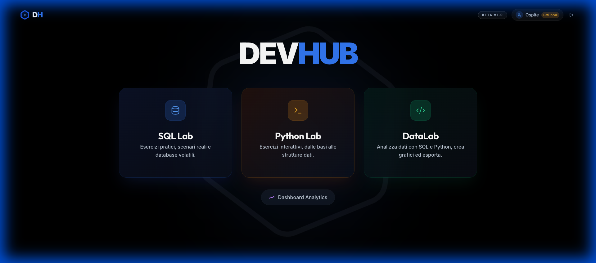
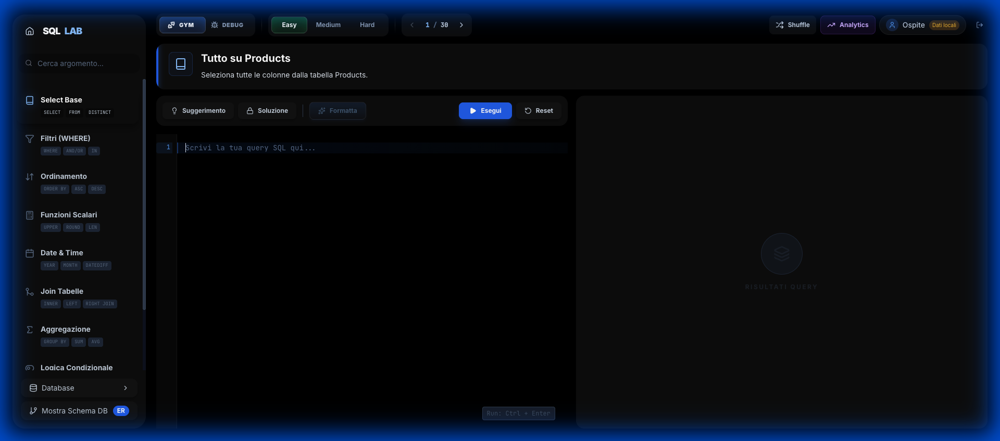
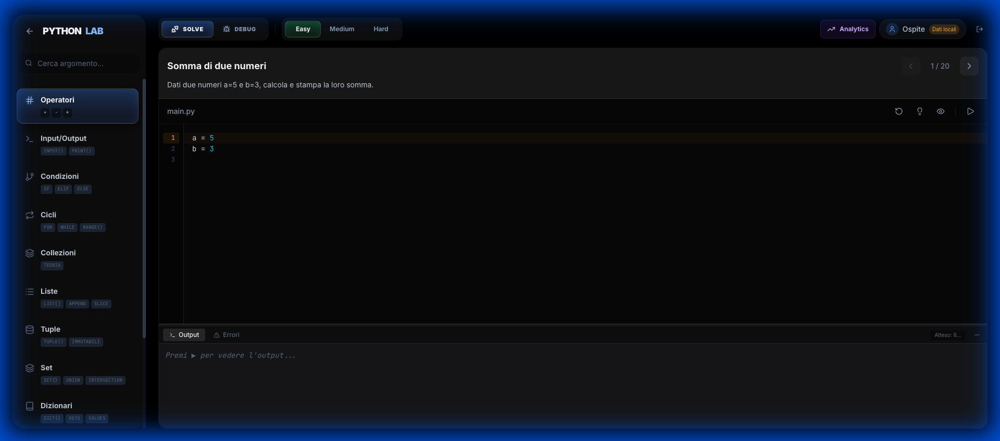
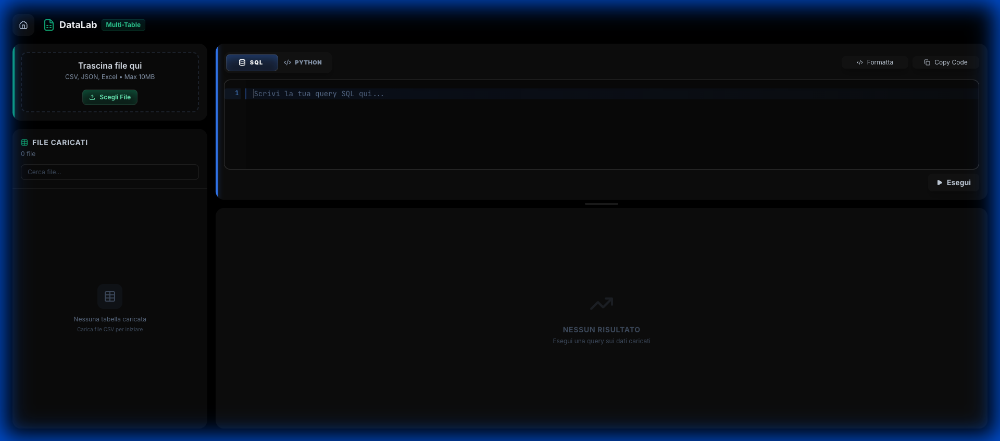
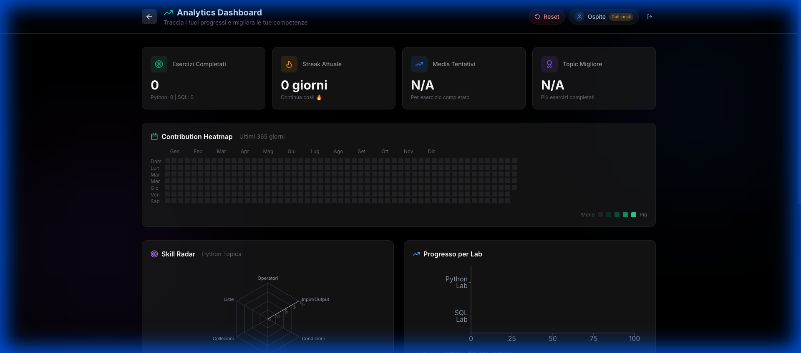
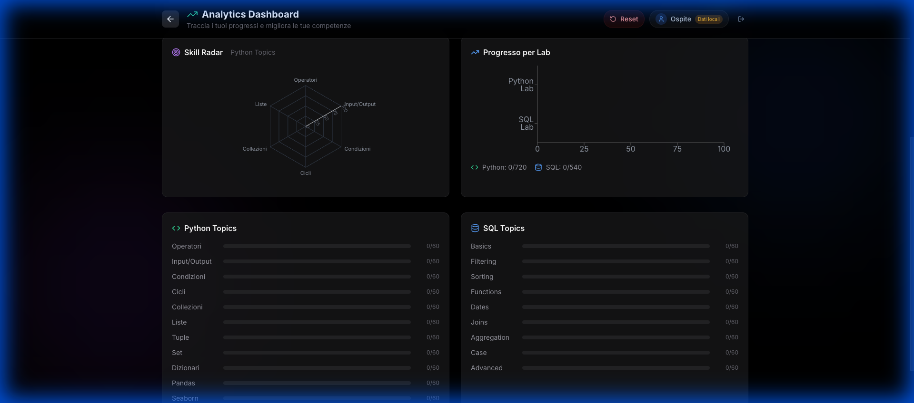

# DevHub - Interactive Dev Playground

**Piattaforma interattiva per SQL, Python e Data Analysis. Esercizi pratici, editor live, grafici professionali e strumenti di analisi dati. Tutto gira nel browser, nessun server richiesto.**

[Demo Live](https://devhub-gray.vercel.app) | [Documentazione Tecnica](#architettura)

## Screenshots



| SQL Lab | Python Lab | DataLab |
| :---: | :---: | :---: |
|  |  |  |

| Analytics Dashboard | Analytics Dashboard |
| :---: | :---: |
|  |  |

---

## Cosa Puoi Fare

- **Oltre 800 esercizi SQL** organizzati per argomento e difficoltà
- **Ambiente Python completo** con 12 argomenti, da basi a Pandas e Seaborn
- **DataLab**: carica file (CSV, JSON, Excel, TSV), analizza con SQL e Python, crea grafici Matplotlib
- **Grafici professionali**: visualizzazioni con QuickChart e Matplotlib, esportabili in PNG, JPG, SVG e PDF
- **Export completo**: scarica tabelle e risultati in CSV, Excel e PDF
- **Salva i progressi**: registrati per sincronizzare su più dispositivi
- **Installabile su smartphone**: funziona come un'app nativa

---

## Moduli dell'Applicazione

### SQL Lab

Il modulo principale per imparare SQL, con esercizi che vanno dalle basi fino alle query avanzate.

#### Argomenti Coperti

| Argomento | Cosa Impari |
| --------- | ----------- |
| Select Base | Selezionare dati, alias, DISTINCT |
| Filtri | WHERE, AND/OR, IN, LIKE, NULL |
| Ordinamento | ORDER BY, LIMIT |
| Funzioni | UPPER, ROUND, LEN, CONCAT |
| Date | Lavorare con date e intervalli |
| Join | Unire più tabelle tra loro |
| Aggregazione | GROUP BY, SUM, AVG, COUNT |
| Logica Condizionale | CASE WHEN |
| Avanzate | Subquery, Window Functions, CTE |

#### Tre Livelli di Difficoltà

- **Facile**: suggerimenti espliciti, perfetto per iniziare
- **Medio**: meno aiuti, richiede più ragionamento
- **Difficile**: solo concetti, devi trovare tu la soluzione

#### Debug Mode

Modalità speciale dove le query contengono errori intenzionali. Devi trovare e correggere:

- Errori di sintassi (virgole mancanti, typo)
- Errori logici (WHERE invece di HAVING)
- Errori avanzati (parentesi mancanti)

---

### DataLab

Un ambiente completo per caricare, analizzare e visualizzare i tuoi dati con SQL e Python.

#### Editor Duale SQL + Python

- **Modalità SQL**: scrivi query SQL standard sui tuoi dati
- **Modalità Python**: editor Python completo con Pyodide, Matplotlib, Pandas e NumPy
- **Switch istantaneo**: passa da SQL a Python con un click

#### Caricamento File Multi-Formato

- **CSV, TSV, JSON, Excel**: trascina o seleziona i file
- **Bridge dati automatico**: i dati caricati sono accessibili sia da SQL che da Python come DataFrame
- **Gestisci tabelle**: rinomina, elimina, modifica colonne
- **Analisi qualità dati**: controlla valori nulli, tipi, statistiche

#### Grafici Matplotlib

Genera grafici professionali direttamente dall'editor Python:

- **Stile professionale**: tema dark con palette colori vibrante e DPI elevati
- **Vista fullscreen**: espandi i grafici a schermo intero con un click
- **Download multi-formato**: esporta in PNG, JPG, SVG o PDF
- **Tabelle esportabili**: esporta DataFrame in CSV e Excel

#### QuickChart - Visualizzazione Dati

Crea grafici interattivi dai risultati SQL in pochi click:

- **4 tipi di grafico**: Barre, Linee, Area, Torta
- **Linee di tendenza**: aggiungi regressioni lineari
- **Annotazioni**: clicca sui punti per aggiungere note
- **Export completo**: PNG, SVG, CSV, JSON o copia negli appunti

---

### Python Lab

Impara Python direttamente nel browser, senza installare nulla.

#### Argomenti

| Argomento | Cosa Impari |
| --------- | ----------- |
| Operatori | +, -, *, /, operazioni matematiche |
| Input/Output | Leggere input e stampare output |
| Condizioni | if, elif, else |
| Cicli | for, while, range() |
| Collezioni | Concetti base delle strutture dati |
| Liste | Creare e modificare liste |
| Tuple | Dati immutabili |
| Set | Insiemi e operazioni |
| Dizionari | Coppie chiave-valore |
| Pandas | DataFrame, Series, filtri, aggregazioni |
| Seaborn | Grafici statistici e visualizzazioni |
| Librerie | NumPy, Datetime, Collections, Random |

#### Due Modalità

- **Solve**: scrivi la soluzione da zero
- **Debug**: trova e correggi i bug nel codice

---

### Analytics Dashboard

Monitora i tuoi progressi con visualizzazioni interattive:

- **Heatmap Contributi**: stile GitHub, mostra l'attività giornaliera
- **Radar Competenze**: grafico a ragnatela per SQL e Python
- **Statistiche Streak**: giorni consecutivi di pratica
- **Riepilogo totale**: esercizi completati, media tentativi, topic migliore

---

## Database degli Esercizi

Gli esercizi usano un database e-commerce realistico:

```text
Users (id, name, email, country, is_premium, created_at)
   |
   +--< Orders (id, user_id, order_date, status, order_total)
          |
          +--< OrderItems (id, order_id, product_id, quantity, unit_price)
                    |
Products (id, name, category, price, stock) >--+

Employees (id, name, department, hire_date, manager_id)
```

---

## Tecnologie Utilizzate

| Categoria | Tecnologia |
| --------- | ---------- |
| Frontend | React + TypeScript |
| Database locale | AlaSQL (tutto nel browser) |
| Backend cloud | Supabase (solo per login e progressi) |
| Python | Pyodide (Python in WebAssembly) |
| Grafici SQL | Recharts |
| Grafici Python | Matplotlib (via Pyodide) |
| PDF | jsPDF |
| Stile | Tailwind CSS |

---

## Architettura

L'app usa un approccio ibrido:

- **Velocità**: il database SQL degli esercizi vive nel browser, quindi le query sono istantanee
- **Persistenza**: i progressi vengono salvati nel cloud con Supabase
- **Privacy**: i tuoi file CSV rimangono locali, non vengono mai inviati a server esterni

---

## Competenze Sviluppate

Questo progetto dimostra competenze in:

- **React avanzato**: gestione stato complessa, hooks personalizzati
- **TypeScript**: tipizzazione rigorosa su un codebase di 10.000+ righe
- **Database**: integrazione AlaSQL + Supabase
- **UX/UI**: interfaccia professionale con dark mode
- **Performance**: ottimizzazione per dispositivi mobile
- **PWA**: app installabile con service worker

---

## Installazione Locale

### Prerequisiti

- Node.js 18 o superiore

### Setup

```bash
git clone https://github.com/username/devhub.git
cd devhub
npm install
npm run dev
```

### Configurazione Cloud (opzionale)

Per abilitare login e sync, crea `.env.local`:

```env
VITE_SUPABASE_URL=tua_url
VITE_SUPABASE_ANON_KEY=tua_key
```

---

## Licenza

MIT

---

**Sviluppato con passione per il clean code e l'apprendimento pratico.**
